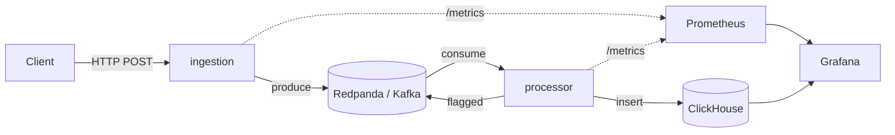

# Real-Time Transaction Monitoring Pipeline

A real-time fraud/anomaly detection pipeline built in Rust, processing
a live stream of financial transactions through Kafka, flagging
suspicious activity with a rules engine, and surfacing everything
through Grafana dashboards.

## Architecture



- **`ingestion`** — Axum HTTP service. Accepts transactions via REST,
  publishes them to Redpanda's `transactions.raw` topic.
- **`processor`** — Kafka consumer. Runs a rules engine against every
  transaction (large-amount threshold, odd-hour heuristic, per-account
  velocity tracking), republishes anything suspicious to
  `transactions.flagged`, and writes every transaction — flagged or
  not — to ClickHouse.
- **Redpanda** — Kafka-API-compatible message broker.
- **ClickHouse** — columnar store for the full transaction history.
- **Prometheus + Grafana** — metrics scraping and dashboards for
  throughput and flagged-vs-clean transaction volume.

## Tech stack

Rust (Axum, `rdkafka`, `clickhouse`, Tokio) · Redpanda · ClickHouse ·
Prometheus · Grafana · Docker Compose

## Quick start

Requires Docker with Compose v2 (Docker Desktop on Windows/Mac, or
Docker Engine + the compose plugin on Linux).

```bash
git clone https://github.com/<your-username>/transaction-pipeline.git
cd transaction-pipeline/docker
docker compose up -d --build
```

First build compiles `librdkafka` from source and takes a few minutes;
every build after that is fast thanks to Docker's dependency-layer
caching.

Once it's up:

| Service        | URL                          |
|----------------|-------------------------------|
| ingestion API  | http://localhost:3001         |
| Grafana        | http://localhost:3000 (admin/admin) |
| Prometheus     | http://localhost:9090         |
| ClickHouse     | `docker exec -it clickhouse clickhouse-client` |

## Try it

Send a transaction that trips the large-amount rule:

```bash
curl -X POST http://localhost:3001/transactions \
  -H "Content-Type: application/json" \
  -d '{"account_id": "acct-1", "amount": 15000, "currency": "USD", "merchant": "Test Merchant"}'
```

Watch it get flagged in real time:

```bash
docker compose logs -f processor
```

Then check it landed in ClickHouse:

```bash
docker exec -it clickhouse clickhouse-client \
  --query "SELECT id, amount, flagged_reasons FROM transaction_pipeline.transactions ORDER BY timestamp DESC LIMIT 5"
```

Or just open the Grafana dashboard at http://localhost:3000 — the
"flagged vs. clean" panel updates live as transactions flow through.

## Fraud rules (current)

- **Large amount** — flags any transaction over $10,000.
- **Odd hour** — flags transactions between 1am–4am UTC.
- **Velocity** — flags an account with more than 5 transactions in a
  60-second window.

## Project structure

transaction-pipeline/
├── Cargo.toml # virtual workspace manifest
├── crates/
│ ├── common/ # shared types + metrics helpers
│ ├── ingestion/ # HTTP -> Kafka producer
│ └── processor/ # Kafka consumer, rules engine, ClickHouse writer
└── docker/
├── docker-compose.yml
├── clickhouse/ # schema + user config overrides
├── grafana/ # dashboards + datasource provisioning
└── prometheus/ # scrape config


## Configuration

Both `ingestion` and `processor` read their Kafka/ClickHouse addresses
from environment variables (`KAFKA_BOOTSTRAP_SERVERS`, `CLICKHOUSE_URL`),
set directly in `docker-compose.yml` for the containerized setup. A
`.env` file (git-ignored) is only needed if running either service
natively outside Docker — see `.env.example` for the expected keys.

## Notes on the Docker setup

The Dockerfiles use a multi-stage build (Rust toolchain in the builder
stage, a minimal Debian runtime image for the final artifact) and
explicitly bootstrap apt over https before installing anything else —
this keeps the build working even on networks that block plain HTTP
package-manager traffic, with no extra configuration required on any
machine.

## Roadmap

- Healthcheck-based service dependencies in Compose (cleaner startup
  ordering, no transient connection-retry log noise)
- Dead-letter queue handling for malformed messages
- Horizontal scaling of `processor` via Kafka consumer groups
